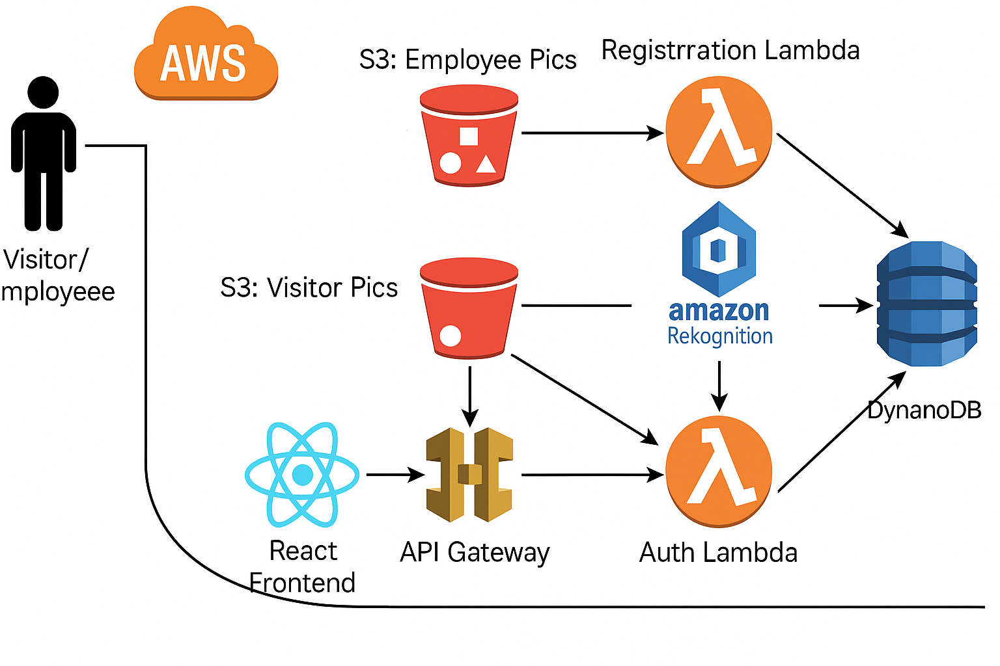

# Facial Authentication System 👤🔐

This is a full-stack facial authentication system built using **React (frontend)**, **AWS services (Lambda, S3, Rekognition, DynamoDB)**, and **Python (backend)**. It authenticates users (employees or visitors) by comparing facial images with stored employee images using Amazon Rekognition.



---

## 🚀 Features

- 📸 Facial registration and verification
- ☁️ AWS S3 buckets for image storage
- 🧠 Facial recognition using Amazon Rekognition
- 🔒 Authentication Lambda functions
- 🧾 Data storage with DynamoDB
- 🌐 React frontend with API Gateway integration

---

## 🛠️ Tech Stack

### Frontend:
- React.js (with Vite)

### Backend:
- AWS Lambda (Python)
- Amazon API Gateway
- Amazon S3
- Amazon Rekognition
- Amazon DynamoDB

---

## 🗂️ Folder Structure

```
Facial_Authentication-System/
│
├── facial-recokgnition-app/        # React frontend (Vite)
│   ├── public/
│   ├── src/
│   ├── architecture.png
│   ├── index.html
│   └── ...
│
├── employee_authentication.py      # AWS Lambda - Auth
├── employee_registrations.py       # AWS Lambda - Registration
├── README.md
```

---

## ⚙️ Installation & Setup Guide

### 🧩 Prerequisites
- Node.js & npm installed
- AWS CLI configured
- Git installed

---

### 🔧 1. Clone the Repository

```bash
git clone https://github.com/MANASA-REDDY04/Facial_Authentication-System.git
cd Facial_Authentication-System
```

---

### 🌐 2. Set Up the Frontend (React + Vite)

```bash
cd facial-recokgnition-app
npm install
npm run dev   # Runs on http://localhost:5173
```

---

### 🖥️ 3. Set Up AWS Infrastructure

> You can deploy these via AWS Console, CLI, or Infrastructure-as-Code.

- **Upload Lambda functions** (`employee_authentication.py`, `employee_registrations.py`)
- **Create S3 Buckets**:
  - `employee-pics-bucket`
  - `visitor-pics-bucket`
- **Set up Rekognition**:
  - Configure face collection for employee registration
- **Create DynamoDB Table** for storing face metadata
- **Link API Gateway** to your Lambda functions

---

### 🧪 4. Test Locally

- Upload an employee photo through the UI
- Try verifying a visitor's photo
- Check console and AWS logs for match results

---

### 🟢 5. Deploy Frontend (Optional)

Use [Netlify](https://www.netlify.com/), [Vercel](https://vercel.com/), or any static hosting:

- **Build the frontend**:
  ```bash
  npm run build
  ```
- **Deploy the `dist/` folder**

---

## 📬 API Endpoints

- `POST /register` → Upload employee image and store face data
- `POST /authenticate` → Upload visitor image and validate against stored records

---

## 👩‍💻 Author

**Manasa Reddy**  
[GitHub Profile](https://github.com/MANASA-REDDY04)

---

## 📝 License

This project is licensed under the MIT License. See the [LICENSE](LICENSE) file for details.
